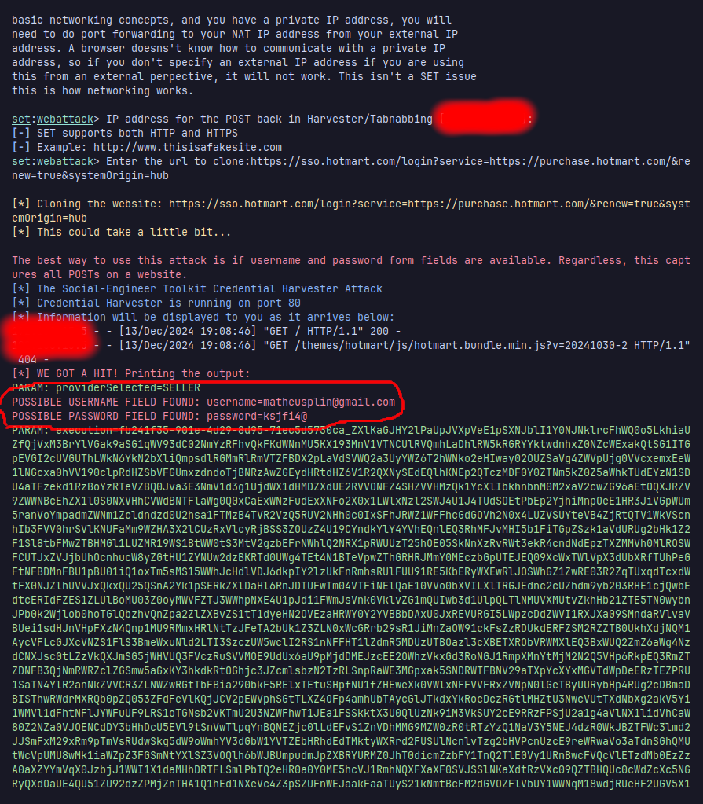

```markdown
🚨 **Criação de Phishing com o Kali Linux e SEToolkit** 🚨

Bem-vindo ao repositório Criação de Phishing com SEToolkit! 🎯
Neste guia, vamos mostrar como criar um ataque de phishing
utilizando o SEToolkit no Kali Linux.
O SEToolkit é uma poderosa ferramenta de engenharia social, usada para testar vulnerabilidades de segurança.

🔧 **Requisitos**

Antes de começar, certifique-se de ter o seguinte:

- Kali Linux 🐧  
- Python 3.x (instalado) 🐍  
- Conhecimento básico em Segurança Cibernética 🛡️

📥 **Instalação do SEToolkit**

O SEToolkit já vem pré-instalado no Kali Linux. Caso não esteja instalado, basta executar o seguinte comando:

```bash
sudo apt update
sudo apt install set
```

🚀 **Iniciando o SEToolkit**

Para iniciar o SEToolkit, execute o seguinte comando no terminal:

```bash
sudo setoolkit
```

Isso abrirá o menu principal do SEToolkit, onde você pode escolher várias opções para realizar ataques de engenharia social.

🌐 **Criando um Ataque de Phishing**

- Selecione *Social-Engineering Attacks*
- Escolha *Website Attack Vectors*
- Selecione o *Credential Harvester Attack Method*  
- Configure o URL do site de phishing que você deseja simular. O SEToolkit criará automaticamente uma cópia do site e começará a capturar as credenciais enviadas.

<br>

#### Tela de Login | Terminal com envio de email e senha

| **Tela de Login** | **Terminal com envio de email e senha** |
|-------------------|----------------------------------------|
|  |  |

⚠️ **Como Resolver o Erro Comum: AttributeError: module 'cgi' has no attribute 'escape'**

Esse erro ocorre devido à remoção do método `cgi.escape()` nas versões mais recentes do Python (3.2+). Vamos corrigir isso! 💡

🛠️ **Solução para Kali Linux**

Abra o arquivo `harvester.py` para edição:

```bash
sudo nano /usr/share/set/src/webattack/harvester/harvester.py
```

Localize a linha que utiliza `cgi.escape()`:

```python
filewrite.write(cgi.escape("PARAM: " + line + "\n"))
```

Substitua `cgi.escape()` por `html.escape()`, que é compatível com versões mais recentes do Python:

```python
import html
filewrite.write(html.escape("PARAM: " + line + "\n"))
```

Salve o arquivo. Se estiver usando o editor `nano`, pressione `CTRL + O` para salvar e depois `CTRL + X` para sair.

Reinicie o SEToolkit:

```bash
sudo setoolkit
```

Agora, o erro deve ser corrigido e o SEToolkit funcionará corretamente. 🙌

✅ **Conclusão**

Parabéns! Agora você sabe como criar um ataque de phishing utilizando o SEToolkit no Kali Linux! 🎉
